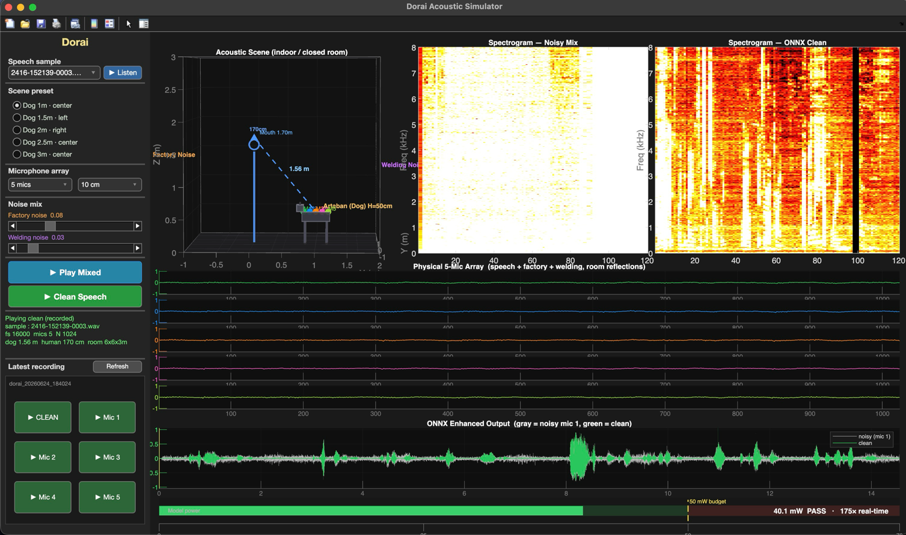

# dorai — ROS 2 Mic-Array Speech Pipeline

`dorai` is a modular 2-stage ROS 2 audio processing pipeline that captures audio from an array of microphones, enhances the multi-channel signals in real time (beamforming), and transcribes the cleaned speech to text.

`voice_mod` runs the full capture-to-enhancement path in a single node: it auto-detects the microphone array, async-resamples every mic to a common 16 kHz timeline with per-mic clock-drift correction, and runs the `dorai_beamformer.ort` beamformer continuously. Enhancement runs on a real-time sliding window with no added algorithmic delay; only the publish of the clean stream is batched into configurable N-second frames (default 10 s). `stt_mod` then transcribes that clean stream using Vosk (streaming, partials) or OpenAI Whisper via `faster-whisper` (whole-utterance).

```
                 +-----------+
                 | voice_mod |  <-- Mic-array capture + drift-corrected 16 kHz
                 |           |      resample + dorai_beamformer.ort beamformer (real-time);
                 +-----------+      publishes clean speech every N seconds
                       |
            [/dorai_clean_audio]
                       v
                  +---------+
                  | stt_mod |  <-- Speech-to-Text (Vosk or Whisper)
                  +---------+
                       |
              [/dorai_transcript]
```

---

## Prerequisites

* **Operating System**: Ubuntu 24.04 LTS (Noble) / Ubuntu Server 24.04
* **ROS 2 Distribution**: Jazzy Jalisco (`ros-jazzy-ros-base` or `ros-jazzy-desktop`)
* **System Libraries**:
  ```bash
  sudo apt update
  sudo apt install python3-colcon-common-extensions libportaudio2 libsamplerate0-dev -y
  ```

---

## Installation & Setup

1. **Create a ROS 2 Workspace**:
   Create a workspace directory structure:
   ```bash
   mkdir -p ~/ros2_ws
   ```

2. **Clone/Copy Modules**:
   Place the two pipeline package directories (`voice_mod`, `stt_mod`) directly inside your workspace.

3. **Install Python Package Dependencies**:
   Install the required Python packages directly to your user-site location (so they are accessible by the system Python interpreter used by ROS 2):
   ```bash
   pip3 install --user --break-system-packages onnxruntime vosk numpy scipy sounddevice samplerate faster-whisper 
   ```

4. **Build the Workspace**:
   Compile the packages using `colcon`:
   ```bash
   colcon build --symlink-install
   ```

5. **Source the Workspace overlay**:
   Source your workspace setup file in each terminal session:
   ```bash
   source ~/ros2_ws/install/setup.bash
   ```

---

## Running the Pipeline

To run the pipeline, start each node in a separate terminal window. Make sure to source the workspace setup script in every terminal.

### 1. Stage 1: Capture + Beamforming (`voice_mod`)

Auto-detects the USB microphone array, async-resamples every mic to a common 16 kHz timeline with per-mic clock-drift correction, runs the `dorai_beamformer.ort` beamformer continuously, and publishes the enhanced single-channel speech in N-second frames:
```bash
ros2 run voice_mod voice
```

#### voice_mod Parameters
* `--ros-args -p publish_interval:=10.0` (Frame length in seconds for the output clean speech; default `10.0` s)
* `--ros-args -p max_mics:=3` (Caps the number of captured channels; default `3`)
* `--ros-args -p requested_rate:=48000` (Preferred capture rate per mic; default `48000` Hz)
* `--ros-args -p include_internal:=false` (Allow built-in/internal microphones; default `false`)
* `--ros-args -p prefer_usb:=true` (Order USB/external mics first; default `true`)
* `--ros-args -p output_topic:=/dorai_clean_audio` (Topic name for enhanced speech; default `/dorai_clean_audio`)
* `--ros-args -p num_threads:=2` (ONNX Runtime intra-op threads; 0 = ORT default, default `2`)
* `--ros-args -p input_latency:=0.0` (PortAudio input latency in seconds, <= 0.0 uses 'high'; default `0.0`)
* `--ros-args -p publish_raw:=false` (Also publish raw, resampled & filtered multi-channel audio; default `false`)
* `--ros-args -p raw_topic:=/dorai_raw_audio` (Topic name for raw multi-channel audio; default `/dorai_raw_audio`)
* `--ros-args -p hpf_hz:=150.0` (Per-mic high-pass filter cutoff frequency in Hz to strip low-frequency rumble, 0.0 disables; default `150.0`)
* `--ros-args -p output_peak:=0.9` (Loudness normalization target peak, 0.0 disables; default `0.9`)
* `--ros-args -p output_max_gain:=12.0` (Maximum gain limit in dB for loudness normalization; default `12.0`)
* `--ros-args -p model_path:=/path/to/dorai_beamformer.ort` (Custom path to the `dorai_beamformer.ort` beamformer model)

*Example — publish clean speech every 5 seconds using up to 4 mics:*
```bash
ros2 run voice_mod voice --ros-args -p publish_interval:=5.0 -p max_mics:=4
```
*Example — publish both raw and clean audio, with custom PortAudio input latency:*
```bash
ros2 run voice_mod voice --ros-args -p publish_raw:=true -p input_latency:=0.05
```

### 2. Stage 2: Speech-To-Text (`stt_mod`)

Subscribes to the clean audio topic, transcribes speech using Vosk or OpenAI Whisper, and publishes/prints results:
```bash
ros2 run stt_mod stt
```

#### Common Parameters
* `--ros-args -p engine:=vosk` (STT engine: `vosk` or `whisper`; default `vosk`)
* `--ros-args -p input_topic:=/dorai_clean_audio` (Clean audio topic to subscribe to; default `/dorai_clean_audio`)
* `--ros-args -p output_topic:=/dorai_transcript` (Topic name for final transcripts; default `/dorai_transcript`)
* `--ros-args -p partial_topic:=/dorai_partial_transcript` (Topic name for real-time partial transcripts; default `/dorai_partial_transcript`)
* `--ros-args -p debug:=false` (Enable verbose STT engine logs; default `false`)

#### Vosk-Specific Parameters (`engine:=vosk`)
* `--ros-args -p model_lang:=en-us` (Vosk language model identifier; default `en-us`)
* `--ros-args -p model_path:=/path/to/vosk-model` (Path to a local Vosk model folder, overrides `model_lang`)

#### Whisper-Specific Parameters (`engine:=whisper`)
* `--ros-args -p whisper_model:=tiny` (Whisper model size/name, e.g. `tiny`, `tiny.en`, `base`, `small`; default `tiny`)
* `--ros-args -p whisper_compute_type:=int8` (Quantization compute type, e.g. `int8`, `float16`; default `int8`)
* `--ros-args -p language:=en` (Language code for transcription, empty string `""` for auto-detect; default `en`)
* `--ros-args -p whisper_beam_size:=1` (Beam size for decoding; default `1`)
* `--ros-args -p num_threads:=4` (CTranslate2 CPU threads; default `4`)

*Example — run streaming STT using Vosk (default):*
```bash
ros2 run stt_mod stt --ros-args -p engine:=vosk -p model_lang:=en-us
```
*Example — run STT using Whisper with a 4-thread CPU pool:*
```bash
ros2 run stt_mod stt --ros-args -p engine:=whisper -p whisper_model:=tiny.en -p num_threads:=4
```

---

## Pipeline Topics

The audio data published on `/dorai_clean_audio` and `/dorai_raw_audio` includes a 4-float header at the start of the data array:
1. `capture_s`: True PortAudio ADC capture time (seconds since node startup).
2. `sample_rate`: Master timeline rate (always `16000.0` Hz).
3. `num_channels`: Number of channels (`1.0` for clean, or active mics count `M` for raw).
4. `sequence_number`: Running frame counter.

The audio samples follow the header in interleaved format: `[ch1_s1, ch2_s1, ..., chM_s1, ch1_s2, ...]`.

| Topic | Data Type | Description |
| :--- | :--- | :--- |
| `/dorai_clean_audio` | `std_msgs/Float32MultiArray` | Enhanced single-channel 16 kHz speech, published in N-second frames. |
| `/dorai_raw_audio` | `std_msgs/Float32MultiArray` | Raw multi-channel 16 kHz speech (resampled & filtered), published only if `publish_raw:=true`. |
| `/dorai_transcript` | `std_msgs/String` | Final transcribed text results. |
| `/dorai_partial_transcript` | `std_msgs/String` | Real-time partial transcripts (Vosk engine only). |
| `/voice_mod/diagnostics` | `std_msgs/String` | Per-mic rate, FIFO/backlog, underruns, xruns, and drift ratio. |

---

## Acoustic Simulator (Lab)

The workspace includes an offline, MATLAB-based physical acoustic simulator inside the [lab/](file:///Users/javad/Projects/dorai/dorai/lab) directory. 



* **Overview**: It simulates a closed room (acoustic space) containing a human speaker standing near an **Artaban robotic dog** equipped with a microphone array on its back.
* **Propagation Physics**: Models 3D sound waves reflecting off room boundaries (floor, ceiling, walls) using the **Image Source Method (ISM)**, mixing human speech with industrial factory and welding noise.
* **Dry Runs**: Feeds the simulated noisy channels directly into `dorai_beamformer.ort` for DSP benchmarking and visualizes speech cleanup.
* **Documentation**: See [lab/README.md](lab/README.md) for detailed abstraction, room dimensions, placement coordinates, diagrams, and execution instructions.
